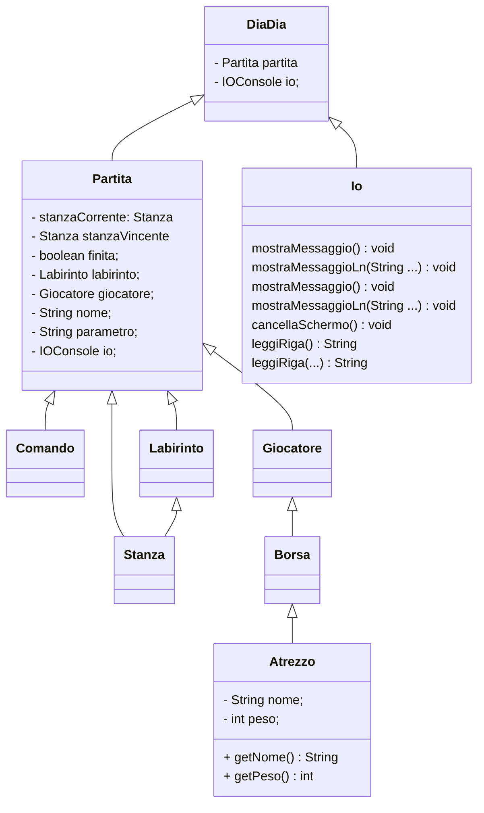

# 2024-HOMEWORK-536594

```mermaid

classDiagram
    DiaDia <|-- Partita
    DiaDia <|-- Io
    Partita <|-- Comando
    Partita <|-- Labirinto
    Partita <|-- Stanza
    Labirinto <|-- Stanza
    Partita <|-- Giocatore
    Giocatore <|-- Borsa
    Borsa <|-- Atrezzo


    class DiaDia{
        - Partita partita
        - IOConsole io;
    }

    class Io{
        mostraMessaggio() void
        mostraMessaggioLn(String ...) void
        mostraMessaggio() void
        mostraMessaggioLn(String ...) void
        cancellaSchermo() void
        leggiRiga() String
        leggiRiga(...) String
    }
    class Partita{
        - stanzaCorrente: Stanza
        - Stanza stanzaVincente
        - boolean finita;
        - Labirinto labirinto;
        - Giocatore giocatore;
    }

    class Partita{
        - String nome;
        - String parametro;
        - IOConsole io;
    }

    class Atrezzo{
        - String nome;
	    - int peso;
        + getNome() String
        + getPeso() int

    }


```
